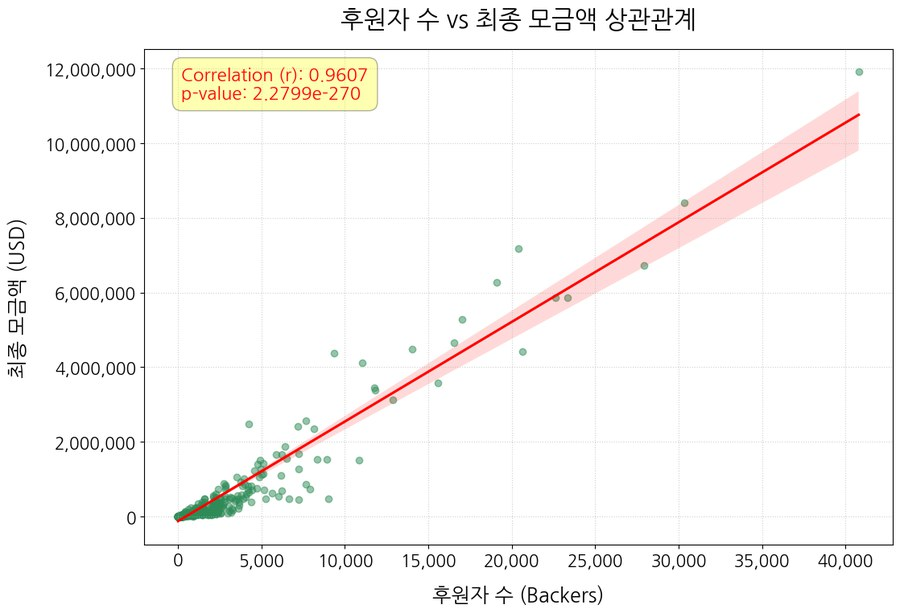
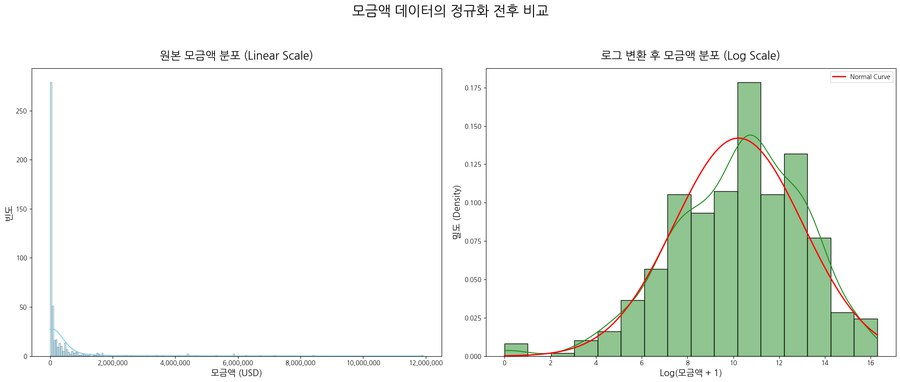

# 보드게임 펀딩 성공 규모 예측 (Gamefound).

캠페인 시작 후 3일간의 댓글 반응과 썸네일 이미지, 기본 정보로 최종 모금액 예측.

ASAC 빅데이터 분석 11기 · 머신러닝 4조(5인) · 2026.06

## 배경

보드게임 크라우드펀딩 시장은 Kickstarter와 Gamefound를 합쳐 약 3.76억 달러 규모.
그런데 창작자가 캠페인을 올리기 전에 성공 가능성을 가늠할 지표는 마땅치 않음.
캠페인 초기 반응만으로 최종 모금액을 어디까지 맞출 수 있는지 확인해봄.

## 결과

| 변수 조합          | MAE    | R²  |
| ------------------ | ------ | ---- |
| Base (기본 정보)   | 25,120 | 0.83 |
| + 썸네일 대표색    | 24,274 | 0.83 |
| + 댓글 감성분석    | 22,151 | 0.85 |
| + 장르 변수 구간화 | 19,750 | 0.89 |

최종 모델 XGBoost. Base 단독 대비 MAE 약 21% 감소.

## backers를 예측 변수에서 뺀 이유



후원자 수(backers)는 최종 모금액과 상관계수 0.96. 넣으면 성능이 크게 오르지만 쓰지 않음.

첫째, 결과 유출. 유튜브 조회수를 예측하면서 구독자 수를 넣는 것과 같아서, 예측력이 높아 보여도 의미 없음.

둘째, 시점 불일치. backers는 펀딩이 끝나야 확정되는 값인데, 이 프로젝트의 목적은 캠페인 시작 후 3일의 반응으로 결과를 가늠하는 것.

강한 변수를 빼면 지표는 나빠지지만 런칭 전에 실제로 쓸 수 있는 모델이 됨. 남은 변수만으로 R² 0.89 확보.

## 목표 변수 분포 처리



대부분 소액이고 소수의 메가 히트가 극단값으로 존재하는 롱테일 분포.
원본 분포로 학습하면 모델이 극단값에 편향되므로, 1.5 IQR 컷오프로 상위 극단값을 제거하고 목표 변수에 로그 변환 적용.

## 파이프라인

```
Gamefound 크롤링
  → 전처리 (펀딩 상태·타입 정제, 1.5 IQR 컷오프, 목표변수 로그 변환)
  → 특징 생성 (댓글 · 이미지 · 기본 정보)
  → XGBoost
```

## 특징 생성

### 댓글 (캠페인 시작 후 3일)

3일차 초기 반응만으로 성공 가능성을 상당 부분 예측할 수 있다는 선행 연구를 근거로 기준 설정.
(Kindler et al., *Early prediction of the outcome of Kickstarter campaigns*)

- XLM-RoBERTa 감성 3분류. BERT와 댓글 100건 대조 후 채택 — 다국어 댓글의 중립 분류가 더 안정적
- Gemini API 의도 6종 분류 (배송 / 제품질문 / 응원 / 불만 / 제안 / 스팸)
- BERTopic 주제 7종 비지도 분류 (BGE-M3 → UMAP → HDBSCAN)

### 썸네일 이미지

- Edge density, 채도, 명도, 대비 추출
- 대표 색상 4종을 IRI 형용사 이미지 스케일로 감성 형용사에 매핑

## 담당 (이종선, 조장)

- backers 변수 제외, 초기 3일 댓글 기준 설정 등 예측 변수 설계 의사결정
- 프로젝트 진척 관리

## 실행

`01_Src/processed/2.1_comment_gemini.ipynb` 는 Gemini API 키 필요.
키는 저장소에 없으니 직접 발급 후 같은 경로에 `api_key.txt` 로 저장하고 실행.

## 한계

극단값을 1.5 IQR로 잘라낸 모델이라 메가 히트 펀딩은 예측 불가.
표본 확충과 메가 히트 전용 모델 분리를 다음 단계로 고려 중.

## 폴더 구조

```text
01_Src/
├── crawling/    Gamefound 프로젝트 · 리워드 · 댓글 수집
├── eda/         탐색적 분석
├── processed/   댓글 전처리, Gemini 의도분류, BERTopic, 조인
├── ml/          모델링 · 튜닝 (1_final_ml_code.ipynb)
└── test/        크롤링 · 조인 테스트

02_Data/         데이터 (미포함)
03_Docs/         참고 문헌 · 사전 지식 자료
04_Etc/          기타
```
